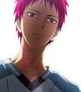

# htmlpractice
## А ВОТ ВАМ И СТИШОК
***Мишка косолапый***

По лесу идет,

(Бодро шагаем)

Шишки собирает,

Песенки поет.

( Приседаем - собираем шишки)

Шишка отскочила

Прямо мишке в лоб.

(Держимся ручками за лоб)

Мишка рассердился

И ногою - топ!

(Топаем ногой)
  

